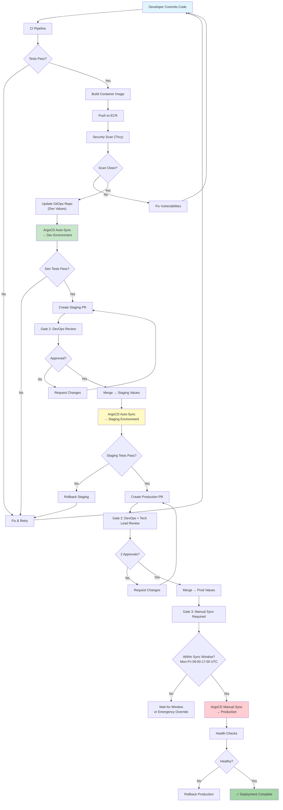

# Deployment Approval Model

**Platform:** AWS EKS 1.35 (us-east-1, 3 AZs)
**GitOps Tool:** ArgoCD
**Last Updated:** 2026-03-27

---

## Overview

The shared-devsecops platform implements a **multi-gate approval model** that ensures every deployment passes through appropriate review, testing, and authorization gates before reaching production. This model balances deployment velocity with safety and compliance.

### Design Principles
- **Shift left**: Catch issues early in the pipeline
- **Progressive trust**: More gates as environments get closer to production
- **Automation first**: Automate everything that can be automated
- **Audit everything**: Every action is traceable to a person and a commit

---

## Approval Flow



---

## Approval Gates

### Gate 1: Code Review (Application Repository)

**Purpose:** Ensure code quality, security, and test coverage before building artifacts.

| Check | Tool | Required |
|-------|------|----------|
| Code linting | ESLint / Pylint / golangci-lint | ✓ |
| Unit tests | Jest / pytest / go test | ✓ |
| Code coverage | Codecov (>80%) | ✓ |
| SAST scanning | SonarQube / Semgrep | ✓ |
| Dependency audit | npm audit / safety / govulncheck | ✓ |
| Container scanning | Trivy | ✓ |
| License compliance | FOSSA / license-checker | ⚠ Advisory |

**Reviewer Requirements:**
- Dev environment: 1 peer reviewer
- Staging/Production: 2 reviewers (1 must be senior)

### Gate 2: GitOps Change Review (GitOps Repository)

**Purpose:** Validate deployment configuration changes before they reach any environment.

| Environment | Reviewers Required | Auto-merge Allowed |
|-------------|-------------------|-------------------|
| Dev | 0 (CI auto-merge for image tags) | ✓ Image tag updates only |
| Staging | 1 DevOps engineer | ✗ |
| Production | 2 (1 DevOps + 1 Tech Lead) | ✗ |

**What's Reviewed:**
- Image tag changes (version pinning)
- Resource allocation changes
- Environment variable modifications
- Ingress/networking changes
- RBAC or security policy changes

### Gate 3: ArgoCD Sync Policy

**Purpose:** Control when and how changes are applied to the cluster.

| Environment | Sync Mode | Self-Heal | Prune |
|-------------|-----------|-----------|-------|
| Dev | Automated | ✓ Enabled | ✓ Enabled |
| Staging | Automated | ✓ Enabled | ✓ Enabled |
| Production | **Manual** | ✗ Disabled | ✓ Enabled |

**Production Manual Sync Process:**
```bash
# 1. Verify the application is out-of-sync (expected after merge)
argocd app get sample-app-production

# 2. Preview the diff
argocd app diff sample-app-production

# 3. Trigger manual sync
argocd app sync sample-app-production

# 4. Monitor rollout
argocd app wait sample-app-production --health
```

### Gate 4: Sync Windows (Production Only)

**Purpose:** Restrict production deployments to safe time windows.

| Window | Schedule | Purpose |
|--------|----------|---------|
| Business Hours | Mon-Fri 09:00-17:00 UTC | Standard deployments |
| Maintenance | Sat 02:00-06:00 UTC | Infrastructure changes |
| Blackout | Configurable | Holiday/freeze periods |

**Sync Window Configuration:**
```yaml
# Defined in argocd/projects/production.yaml
syncWindows:
  - kind: allow
    schedule: "0 9 * * 1-5"    # Mon-Fri 09:00 UTC
    duration: 8h                 # Until 17:00 UTC
    applications:
      - "*"
```

---

## Approval Matrix

| Change Type | Dev | Staging | Production |
|------------|-----|---------|------------|
| **Image tag update** | Auto | 1 approval | 2 approvals + manual sync |
| **Config change** | Auto | 1 approval | 2 approvals + manual sync |
| **Resource change** | Auto | 1 approval | 2 approvals + manual sync |
| **New application** | 1 approval | 2 approvals | 2 approvals + platform review |
| **Infrastructure change** | 1 approval | 2 approvals | 2 approvals + change ticket |
| **RBAC/Security change** | 1 approval | 2 approvals | 2 approvals + security review |
| **Rollback** | Auto | 1 approval | 1 approval (expedited) |
| **Emergency fix** | Auto | Auto (post-review) | 1 approval + override |

---

## Emergency Deployment Process

For critical production issues that cannot wait for normal approval flow:

### Criteria for Emergency Deployment
- P1/P2 incident in progress
- Security vulnerability actively exploited
- Data loss or corruption occurring
- Complete service outage

### Emergency Process

1. **Declare Emergency**
   - Create incident in PagerDuty/Slack
   - Tag PR with `EMERGENCY` label

2. **Fast-Track CI**
   - Skip non-critical checks (coverage, license)
   - Keep security scanning (Trivy)
   - Keep unit tests

3. **Expedited Review**
   - Single platform admin approval (instead of 2)
   - Can be approved via Slack reaction

4. **Override Sync Window**
   ```bash
   # Platform admin overrides sync window
   argocd app sync sample-app-production --force
   ```

5. **Deploy and Monitor**
   ```bash
   # Watch rollout
   argocd app wait sample-app-production --health --timeout 300
   
   # Verify health
   kubectl get pods -n prod-sample-app
   kubectl logs -n prod-sample-app -l app.kubernetes.io/name=sample-app --tail=50
   ```

6. **Post-Incident**
   - Post-incident review within 24 hours
   - Document in incident report
   - Retroactive second approval on the PR
   - Update runbooks if needed

---

## Audit Trail

### What's Tracked

| Event | Source | Retention |
|-------|--------|-----------|
| Code commits | Git (app repo) | Permanent |
| PR reviews & approvals | GitHub/GitLab | Permanent |
| Image builds | CI pipeline logs | 90 days |
| Security scan results | Trivy/SonarQube | 90 days |
| GitOps config changes | Git (gitops repo) | Permanent |
| ArgoCD sync events | ArgoCD audit logs | 90 days |
| Manual sync triggers | ArgoCD + Slack notifications | 90 days |
| Rollback events | Git + ArgoCD | Permanent |

### Traceability Chain

```
Code Commit (SHA) → PR (#123) → Image (v1.2.3) → GitOps Commit (SHA) → ArgoCD Sync → Deployment
```

Every production deployment can be traced back to:
- The exact code change
- Who reviewed and approved it
- When it was deployed
- Who triggered the sync

---

## Compliance Controls

### Separation of Duties
- Developers **cannot** approve their own PRs
- The person who writes code **cannot** be the sole approver for production
- Platform admins who override sync windows must document the reason

### Four-Eyes Principle
- All production changes require at least 2 human approvals
- Emergency deployments require retroactive second approval within 24 hours

### Access Reviews
- Quarterly review of ArgoCD RBAC roles
- Quarterly review of Git repository access
- Annual review of emergency override usage

### Evidence Collection
- All approval evidence stored in Git (PR comments, reviews)
- ArgoCD audit logs exported to CloudWatch
- Slack notification history serves as secondary audit trail

---

## Notification Flow

```
Deployment Event → ArgoCD Notifications → Slack Channel
                                        → Microsoft Teams (optional)
                                        → PagerDuty (failures only)
```

| Event | Dev Channel | Staging Channel | Prod Channel | PagerDuty |
|-------|-------------|-----------------|--------------|-----------|
| Sync started | ✓ | ✓ | ✓ | |
| Sync succeeded | ✓ | ✓ | ✓ | |
| Sync failed | ✓ | ✓ | ✓ | ✓ |
| Health degraded | | ✓ | ✓ | ✓ |
| Drift detected | | | ✓ | |
