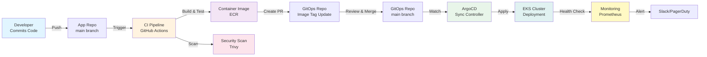

# GitOps Operating Model

**Platform:** AWS EKS 1.35 (us-east-1, 3 AZs)  
**GitOps Tool:** ArgoCD  
**Last Updated:** 2026-03-27  
**Version:** 1.0

---

## Overview

The shared-devsecops platform operates on a **GitOps model** where Git is the single source of truth for all infrastructure and application deployments. ArgoCD continuously reconciles the actual cluster state with the desired state defined in Git repositories.

### Core Principle
> **Git is the source of truth. The cluster follows Git.**

All changes to infrastructure, configurations, and deployments flow through Git. This ensures:
- **Auditability**: Every change is tracked with commit history
- **Reproducibility**: Environments can be recreated from Git
- **Automation**: Changes are automatically applied without manual intervention
- **Rollback Capability**: Any state can be restored by reverting commits

---

## GitOps Principles

### 1. Declarative
All system state is described declaratively in Git repositories:
- Infrastructure defined in Terraform
- Application deployments defined in Kubernetes manifests and Helm charts
- Configuration stored in values files
- No imperative commands (no `kubectl apply` from laptops)

### 2. Versioned
Every change is tracked through Git:
- All commits have author, timestamp, and message
- Changes can be reviewed before merging
- Full audit trail of who changed what and when
- Easy to identify when issues were introduced

### 3. Automated
ArgoCD continuously reconciles cluster state:
- Watches Git repositories for changes
- Automatically pulls and applies changes
- No manual deployment steps required
- Reduces human error and deployment time

### 4. Observable
Built-in monitoring and drift detection:
- Real-time sync status in ArgoCD UI
- Prometheus metrics for all deployments
- Drift detection alerts when cluster diverges from Git
- Health checks on all resources

---

## Repository Strategy

### Three-Repository Model

```
┌─────────────────────────────────────────────────────────────┐
│                    Git Repositories                         │
├─────────────────────────────────────────────────────────────┤
│                                                             │
│  ┌──────────────────┐  ┌──────────────────┐  ┌──────────┐ │
│  │ Infrastructure   │  │ GitOps           │  │ App      │ │
│  │ Repo             │  │ Repo             │  │ Repos    │ │
│  │ (This Repo)      │  │ (gitops/)        │  │ (Separate)
│  │                  │  │                  │  │          │ │
│  │ • Terraform      │  │ • Helm values    │  │ • Source │ │
│  │ • ArgoCD config  │  │ • Manifests      │  │ • CI/CD  │ │
│  │ • VPC, EKS, ALB  │  │ • Kustomize      │  │ • Tests  │ │
│  │ • IAM, Secrets   │  │ • Per-env config │  │ • Images │ │
│  └──────────────────┘  └──────────────────┘  └──────────┘ │
│                                                             │
└─────────────────────────────────────────────────────────────┘
```

#### Repository 1: Infrastructure Repo (shared-devsecops)
**Purpose:** AWS infrastructure and platform configuration  
**Contents:**
- Terraform modules for EKS, VPC, ALB, RDS, etc.
- ArgoCD installation and configuration
- Platform-level policies and RBAC
- Secrets management (sealed secrets, external secrets)
- Monitoring and logging infrastructure

**Branch Strategy:**
- `main`: Production infrastructure
- `develop`: Staging infrastructure
- Feature branches for changes

#### Repository 2: GitOps Repo (gitops/ directory)
**Purpose:** Application deployment manifests and Helm values  
**Contents:**
- Helm chart values for each application
- Environment-specific overrides (dev/staging/prod)
- Kustomize patches for customization
- ArgoCD Application resources
- Deployment policies per environment

**Structure:**
```
gitops/
├── apps/
│   ├── app-name-1/
│   │   ├── Chart.yaml
│   │   ├── values.yaml
│   │   ├── values-dev.yaml
│   │   ├── values-staging.yaml
│   │   └── values-prod.yaml
│   └── app-name-2/
├── argocd/
│   ├── applications/
│   ├── appprojects/
│   └── policies/
└── kustomize/
    ├── base/
    └── overlays/
        ├── dev/
        ├── staging/
        └── prod/
```

#### Repository 3: Application Repos (Separate)
**Purpose:** Application source code and CI pipelines  
**Contents:**
- Application source code
- Dockerfile for containerization
- CI pipeline (GitHub Actions, GitLab CI, etc.)
- Unit tests, integration tests
- Container image scanning
- Image tag updates to GitOps repo

**CI Pipeline Output:**
- Builds container image
- Pushes to ECR with semantic version tag
- Creates PR in GitOps repo to update image tag
- Triggers ArgoCD sync

---

## Workflow

### End-to-End Deployment Flow



### Development Flow

**Frequency:** Multiple times per day  
**Approval:** Automated (code review only)  
**Sync Policy:** Automatic

1. Developer creates feature branch in app repo
2. Commits code and pushes to GitHub
3. CI pipeline runs:
   - Linting and formatting checks
   - Unit tests
   - SAST scanning (SonarQube)
   - Build container image
   - Container scanning (Trivy)
4. Developer creates PR with test results
5. Code review (minimum 1 reviewer)
6. Merge to `main` triggers image build
7. CI creates PR in GitOps repo with new image tag
8. Auto-merge to `gitops/main` (dev environment)
9. ArgoCD detects change and syncs immediately
10. Application deployed to dev namespace

**Rollback:** Revert commit in GitOps repo (< 2 minutes)

### Staging Promotion

**Frequency:** Daily or on-demand  
**Approval:** 1 DevOps engineer  
**Sync Policy:** Automatic after merge

1. Image is already built and tested in dev
2. Create PR in GitOps repo to update staging values
3. PR includes:
   - Image tag update
   - Configuration changes (if any)
   - Release notes
4. DevOps engineer reviews and approves
5. Merge to `gitops/main`
6. ArgoCD syncs to staging namespace
7. Automated smoke tests run
8. Alert on Slack if tests fail

**Rollback:** Revert commit in GitOps repo (< 5 minutes)

### Production Promotion

**Frequency:** Weekly or on-demand  
**Approval:** 2 approvals (DevOps + Tech Lead)  
**Sync Policy:** Manual sync required  
**Sync Window:** Mon-Fri 09:00-17:00 UTC

1. Image tested in staging for minimum 24 hours
2. Create PR in GitOps repo to update production values
3. PR includes:
   - Image tag update
   - Configuration changes
   - Detailed release notes
   - Rollback plan
4. First approval: DevOps engineer (technical review)
5. Second approval: Tech Lead (business/risk review)
6. Merge to `gitops/main`
7. **Manual sync required** in ArgoCD UI
8. Deployment happens during sync window
9. Canary deployment (10% → 50% → 100%)
10. Automated health checks and smoke tests
11. Alert on Slack with deployment status

**Rollback:** Manual revert + manual sync (< 10 minutes)

---

## Roles and Responsibilities

| Role | Responsibility | Permissions |
|------|-----------------|-------------|
| **Developer** | Write application code, create PRs, fix bugs | Push to feature branches, create PRs in app repo |
| **Code Reviewer** | Review code quality, security, tests | Approve/reject PRs in app repo |
| **DevOps Engineer** | Manage infrastructure, review deployments, handle incidents | Approve PRs in GitOps repo, manual sync in ArgoCD, infrastructure changes |
| **Tech Lead** | Approve production changes, manage risk | Approve production PRs in GitOps repo, override sync windows for emergencies |
| **Platform Team** | Maintain ArgoCD, monitoring, disaster recovery | Full access to ArgoCD, cluster, infrastructure |
| **Security Team** | Review security policies, scan images, audit access | Review SAST/container scan results, audit logs |

---

## Environment Strategy

| Aspect | Development | Staging | Production |
|--------|-------------|---------|-----------|
| **Namespace** | `dev` | `staging` | `prod` |
| **Naming** | `{app}-dev-*` | `{app}-staging-*` | `{app}-prod-*` |
| **Replicas** | 1-2 | 2-3 | 3+ |
| **Resources** | Low (0.5 CPU, 256Mi) | Medium (1 CPU, 512Mi) | High (2+ CPU, 1Gi+) |
| **Sync Policy** | Automatic | Automatic | Manual |
| **Sync Interval** | 3 minutes | 5 minutes | N/A (manual) |
| **Approval Required** | Code review only | 1 DevOps approval | 2 approvals + sync window |
| **Rollback SLA** | 2 minutes | 5 minutes | 10 minutes |
| **Monitoring** | Basic | Standard | Enhanced |
| **Alerts** | Slack #dev | Slack #staging | Slack #prod + PagerDuty |
| **Data Retention** | 7 days | 30 days | 90 days |
| **Backup Frequency** | Daily | Daily | Hourly |

---

## Monitoring and Alerting

### ArgoCD Health Monitoring

**Metrics Tracked:**
- Application sync status (synced/out-of-sync)
- Sync duration
- Reconciliation frequency
- Resource health (healthy/degraded/unknown)
- Deployment success rate

**Alerts:**
- Application out-of-sync for > 5 minutes
- Sync failure
- Resource degraded
- High reconciliation latency

### Application Health Monitoring

**Checks:**
- Pod readiness probes
- Liveness probes
- HTTP endpoint health checks
- Database connectivity
- External service dependencies

**Dashboards:**
- ArgoCD UI: Real-time sync status
- Grafana: Application metrics
- Prometheus: Infrastructure metrics
- CloudWatch: AWS resource metrics

### Incident Response

**On Alert:**
1. Check ArgoCD UI for sync status
2. Review recent commits in GitOps repo
3. Check application logs in CloudWatch
4. Determine if rollback needed
5. Execute rollback if necessary
6. Post-incident review

---

## Secret Management

### Sealed Secrets Approach

**Workflow:**
1. Developer creates secret in plaintext locally
2. Seals secret using `kubeseal` with public key
3. Commits sealed secret to Git (safe)
4. ArgoCD applies sealed secret
5. Sealed Secrets controller decrypts using private key

**Storage:**
- Sealed Secrets private key: AWS Secrets Manager
- Public key: Stored in repo for sealing
- Never commit private key to Git

### External Secrets Operator (ESO)

**For sensitive data:**
1. Store secrets in AWS Secrets Manager
2. ESO syncs to Kubernetes Secrets
3. Applications consume Kubernetes Secrets
4. No secrets in Git

**Supported Sources:**
- AWS Secrets Manager
- AWS Parameter Store
- HashiCorp Vault
- Azure Key Vault

### Secret Rotation

**Frequency:**
- Database passwords: Every 90 days
- API keys: Every 180 days
- TLS certificates: Every 365 days (auto-renewed)

**Process:**
1. Update secret in AWS Secrets Manager
2. ESO detects change and updates Kubernetes Secret
3. Pod restart triggers (if needed)
4. No Git changes required

---

## Disaster Recovery

### Backup Strategy

**What's Backed Up:**
- EKS cluster state (etcd)
- Persistent volumes
- Git repositories
- ArgoCD configuration
- Secrets (encrypted)

**Backup Frequency:**
- Cluster state: Hourly
- Persistent volumes: Daily
- Git repositories: Continuous (GitHub)

**Retention:**
- Development: 7 days
- Staging: 30 days
- Production: 90 days

### Recovery Procedures

#### Scenario 1: Single Pod Failure
- **Detection:** Kubernetes automatically restarts pod
- **Time to Recovery:** < 1 minute
- **Action:** None (automatic)

#### Scenario 2: Node Failure
- **Detection:** Kubernetes marks node as NotReady
- **Time to Recovery:** 2-5 minutes
- **Action:** Pods automatically reschedule to healthy nodes

#### Scenario 3: Cluster Failure
- **Detection:** Multiple nodes down, cluster unhealthy
- **Time to Recovery:** 30-60 minutes
- **Action:** 
  1. Restore from backup
  2. Verify cluster health
  3. Sync ArgoCD to redeploy applications
  4. Verify data consistency

#### Scenario 4: Data Loss
- **Detection:** Application reports missing data
- **Time to Recovery:** 1-24 hours (depends on backup age)
- **Action:**
  1. Restore PVC from snapshot
  2. Verify data integrity
  3. Restart affected pods

### RTO and RPO

| Component | RTO | RPO |
|-----------|-----|-----|
| Pod | < 1 min | N/A |
| Node | 2-5 min | N/A |
| Cluster | 30-60 min | 1 hour |
| Data | 1-24 hours | 1 hour |

---

## Best Practices

### Git Repository Management
- ✅ Use meaningful commit messages
- ✅ Keep commits atomic (one logical change per commit)
- ✅ Use semantic versioning for releases
- ✅ Tag releases in Git
- ✅ Protect main branch with required reviews
- ❌ Don't commit secrets (use Sealed Secrets or ESO)
- ❌ Don't make manual changes to cluster

### ArgoCD Configuration
- ✅ Use AppProject for RBAC
- ✅ Set appropriate sync policies per environment
- ✅ Enable auto-sync only for dev
- ✅ Use health assessment rules
- ✅ Configure notifications for failures
- ❌ Don't use default project in production
- ❌ Don't disable sync policies

### Deployment Best Practices
- ✅ Always use image tags (never `latest`)
- ✅ Use semantic versioning for images
- ✅ Test in dev before staging
- ✅ Test in staging before production
- ✅ Use canary deployments for production
- ✅ Have rollback plan before deploying
- ❌ Don't deploy directly to production
- ❌ Don't skip testing phases

### Monitoring and Observability
- ✅ Monitor all deployments
- ✅ Set up alerts for failures
- ✅ Track deployment metrics
- ✅ Review logs regularly
- ✅ Conduct post-incident reviews
- ❌ Don't ignore alerts
- ❌ Don't deploy without monitoring

---

## Troubleshooting

### Application Out of Sync

**Symptoms:** ArgoCD shows "OutOfSync" status

**Causes:**
1. Manual changes made to cluster
2. External controller modified resources
3. Git commit not yet synced

**Resolution:**
```bash
# Option 1: Sync from ArgoCD UI
# Click "Sync" button in ArgoCD UI

# Option 2: Sync via CLI
argocd app sync <app-name>

# Option 3: Revert manual changes
kubectl delete <resource> -n <namespace>
# ArgoCD will recreate from Git
```

### Sync Failure

**Symptoms:** ArgoCD shows "SyncFailed" status

**Causes:**
1. Invalid Kubernetes manifest
2. Missing ConfigMap or Secret
3. Resource quota exceeded
4. Image not found in registry

**Resolution:**
```bash
# Check ArgoCD logs
argocd app logs <app-name>

# Check application events
kubectl describe pod <pod-name> -n <namespace>

# Check resource status
kubectl get all -n <namespace>

# Fix issue in Git and commit
git commit -am "Fix: <issue description>"
git push

# Sync again
argocd app sync <app-name>
```

### Drift Detection Issues

**Symptoms:** Drift detected but no changes in Git

**Causes:**
1. External controller modified resources
2. Operator updated resources
3. Manual changes by other tools

**Resolution:**
```bash
# View drift details
argocd app diff <app-name>

# Option 1: Accept drift (update Git)
# Make same changes in Git and commit

# Option 2: Revert drift (restore from Git)
argocd app sync <app-name> --force
```

---

## Related Documentation

- [Deployment Approval Model](./deployment-approval-model.md)
- [Rollback Procedures](./rollback-procedures.md)
- [Drift Detection](./drift-detection.md)
- [Helm Chart Standards](./helm-chart-standards.md)
- [Environment Values Convention](./environment-values-convention.md)

---

## Document History

| Version | Date | Author | Changes |
|---------|------|--------|---------|
| 1.0 | 2026-03-27 | Platform Team | Initial version |

---

**Questions?** Contact the Platform Team in #platform-engineering Slack channel.
