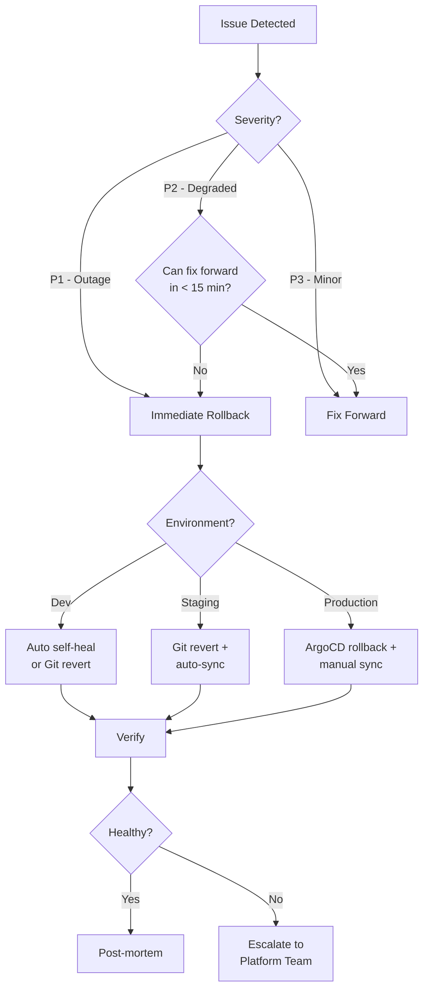

# Rollback Procedures

**Platform:** AWS EKS 1.35 (us-east-1, 3 AZs)
**GitOps Tool:** ArgoCD
**Last Updated:** 2026-03-27

---

## Overview

This document provides step-by-step rollback procedures for ArgoCD-managed deployments. All rollbacks follow the GitOps principle: **the desired state lives in Git**, so the preferred rollback method is always a Git revert.

### Rollback Decision Tree



---

## Rollback Methods

### Method 1: Git Revert (Recommended)

The safest and most auditable rollback method. Creates a new commit that undoes the problematic change.

```bash
# 1. Identify the bad commit
git log --oneline -10

# 2. Revert the commit
git revert <commit-sha> --no-edit

# 3. Push the revert
git push origin main

# 4. ArgoCD will auto-sync (dev/staging) or wait for manual sync (prod)
```

**Pros:** Full audit trail, follows GitOps principles, easy to understand
**Cons:** Slightly slower than ArgoCD rollback (requires Git push + sync)

### Method 2: ArgoCD CLI Rollback

Faster than Git revert. Rolls back to a previous ArgoCD sync revision.

```bash
# 1. List application history
argocd app history sample-app-production

# Output:
# ID  DATE                           REVISION
# 5   2026-03-27 14:30:00 +0000 UTC  abc1234 (main)
# 4   2026-03-26 10:00:00 +0000 UTC  def5678 (main)
# 3   2026-03-25 09:00:00 +0000 UTC  ghi9012 (main)

# 2. Rollback to revision 4
argocd app rollback sample-app-production 4

# 3. Verify the rollback
argocd app get sample-app-production
argocd app wait sample-app-production --health
```

**Pros:** Fastest rollback method, no Git operations needed
**Cons:** Creates drift between Git and cluster (must follow up with Git revert)

> ⚠ **Important:** After an ArgoCD rollback, always follow up with a Git revert to keep Git as the source of truth. Otherwise, the next sync will re-deploy the bad version.

### Method 3: ArgoCD UI Rollback

For teams that prefer a visual interface.

1. Open ArgoCD UI → Navigate to the application
2. Click **"History and Rollback"** tab
3. Find the last known good revision
4. Click **"Rollback"** button
5. Confirm the rollback
6. Monitor the sync status

### Method 4: Force Sync to Specific Revision

Sync to a specific Git commit SHA.

```bash
# Sync to a specific known-good commit
argocd app sync sample-app-production --revision def5678

# With force flag (overrides sync window)
argocd app sync sample-app-production --revision def5678 --force
```

---

## Rollback Scenarios

### Scenario 1: Bad Image Deployment

**Symptoms:** Pods in CrashLoopBackOff, health checks failing, error rate spike

**Steps:**
```bash
# 1. Confirm the issue
kubectl get pods -n prod-sample-app
kubectl logs -n prod-sample-app -l app.kubernetes.io/name=sample-app --tail=50

# 2. Check what changed
argocd app history sample-app-production
argocd app diff sample-app-production

# 3. Rollback via Git (update image tag to previous version)
cd gitops-repo
git log --oneline apps/production/sample-app/values.yaml

# 4. Revert the image tag change
git revert <commit-sha> --no-edit
git push origin main

# 5. Manual sync (production)
argocd app sync sample-app-production

# 6. Verify
kubectl rollout status deployment/sample-app -n prod-sample-app
kubectl get pods -n prod-sample-app
```

### Scenario 2: Configuration Error

**Symptoms:** Application starts but behaves incorrectly, wrong environment variables, misconfigured endpoints

**Steps:**
```bash
# 1. Identify the config change
git log --oneline -5 apps/production/sample-app/values.yaml
git diff HEAD~1 apps/production/sample-app/values.yaml

# 2. Revert the config change
git revert <commit-sha> --no-edit
git push origin main

# 3. Sync
argocd app sync sample-app-production

# 4. Verify config is correct
kubectl get configmap -n prod-sample-app -o yaml
kubectl exec -n prod-sample-app deploy/sample-app -- env | grep -E "LOG_LEVEL|ENVIRONMENT"
```

### Scenario 3: Full Application Rollback

**Symptoms:** Multiple issues, need to roll back to a known-good state from days ago

**Steps:**
```bash
# 1. Find the last known-good commit
git log --oneline --since="3 days ago" apps/production/sample-app/

# 2. Reset to that state (creates a new commit)
git checkout <good-commit-sha> -- apps/production/sample-app/values.yaml
git commit -m "rollback: revert sample-app to known-good state from <date>"
git push origin main

# 3. Sync
argocd app sync sample-app-production

# 4. Full verification
kubectl get all -n prod-sample-app
kubectl top pods -n prod-sample-app
curl -s https://sample-app.internal.example.com/healthz
```

### Scenario 4: Infrastructure Component Rollback

**Symptoms:** Platform component (ingress, cert-manager, monitoring) causing issues

**Steps:**
```bash
# 1. Identify the component
argocd app list --project platform

# 2. Check history
argocd app history ingress-nginx

# 3. Rollback the component
argocd app rollback ingress-nginx <revision>

# 4. Verify
kubectl get pods -n ingress-nginx
kubectl get ingress --all-namespaces

# 5. Follow up with Git revert
git revert <commit-sha> --no-edit
git push origin main
```

---

## Rollback Verification Checklist

After every rollback, verify:

- [ ] All pods are Running and Ready
- [ ] Liveness probes passing
- [ ] Readiness probes passing
- [ ] No error logs in application (`kubectl logs`)
- [ ] Metrics returning to baseline (Prometheus/Grafana)
- [ ] HTTP endpoints responding correctly
- [ ] External dependencies connected (DB, cache, queues)
- [ ] User-facing functionality verified (smoke test)
- [ ] ArgoCD shows application as Synced and Healthy
- [ ] No drift detected between Git and cluster
- [ ] Slack notification confirms successful rollback

---

## Rollback SLA

| Environment | Target RTO | Method | Approval |
|-------------|-----------|--------|----------|
| Dev | N/A | Auto self-heal | None |
| Staging | 15 minutes | Git revert + auto-sync | 1 approval |
| Production | 10 minutes | ArgoCD rollback + manual sync | 1 approval (expedited) |

### Timeline Breakdown (Production)

| Step | Time | Cumulative |
|------|------|-----------|
| Issue detected | 0 min | 0 min |
| Decision to rollback | 2 min | 2 min |
| Execute rollback command | 1 min | 3 min |
| Pods rolling out | 3-5 min | 6-8 min |
| Health checks pass | 2 min | 8-10 min |
| Verification complete | 2 min | 10-12 min |

---

## Post-Rollback Actions

### Immediate (within 1 hour)
1. **Notify stakeholders** via Slack #incidents channel
2. **Create incident ticket** in Jira/Linear
3. **Ensure Git reflects the rollback** (Git revert if ArgoCD rollback was used)
4. **Document what happened** in the incident ticket

### Short-term (within 24 hours)
5. **Root cause analysis** — identify why the bad change was deployed
6. **Fix forward in dev** — fix the issue and test in dev environment
7. **Update tests** — add tests that would have caught the issue
8. **Review approval process** — did the gates work? What was missed?

### Long-term (within 1 week)
9. **Post-incident review** meeting with team
10. **Update runbooks** if the rollback process could be improved
11. **Implement preventive measures** (better tests, canary deployments, etc.)
12. **Re-deploy the fix** through the normal promotion flow

---

## Useful Commands Reference

```bash
# === ArgoCD Application Status ===
argocd app get <app-name>                    # Full status
argocd app get <app-name> -o json            # JSON output
argocd app diff <app-name>                   # Show diff with Git

# === ArgoCD History & Rollback ===
argocd app history <app-name>                # List revisions
argocd app rollback <app-name> <revision>    # Rollback to revision
argocd app sync <app-name> --revision <sha>  # Sync to specific commit

# === Kubernetes Debugging ===
kubectl get pods -n <namespace> -w            # Watch pods
kubectl describe pod <pod> -n <namespace>     # Pod details
kubectl logs -n <namespace> -l app=<name>     # Application logs
kubectl rollout status deploy/<name> -n <ns>  # Rollout status
kubectl rollout undo deploy/<name> -n <ns>    # K8s-level rollback (last resort)

# === Quick Health Check ===
kubectl get pods -n <namespace> -o wide
kubectl top pods -n <namespace>
curl -sf https://<app-url>/healthz && echo "OK" || echo "FAIL"
```
